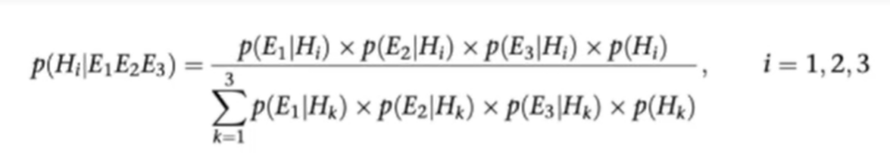

= Naive Bayes Example
Simple implementation of Naive Bayes on C#.

== Bayes Therom
Bayes Therom is an extension of Conditional Propability. Conditional Propability helps us to determine the propability of A when given B, denoted by P(A|B).

image::https://cdn1.byjus.com/wp-content/uploads/2020/10/Bayes-Theorem.png[title="Bayes Formula", link="https://byjus.com/maths/bayes-theorem/"]

== How Naive Bayes Works In Our Example
In our example, we will determine a bank customer can take loan based on customer's age, income and credit score.

Possible values for age are *young*, *middle age*, *old*.

Possible values for income are *low*, *middle*, *high*.

Possible values for credit score are *very risky*, *medium risk*, *low risk*, *good*, *very good*.

Outcome values are [green]#*Approvable*#, [red]#*Not Approved*#

=== Training Process
In the training process first we calculate the possibilities of outcomes and then create possibility tables for age, income and credit score.

==== Training Data Set
[colls="1, 1, 1, 1"]
|===
|Age |Income | Credit Score | Outcomes

|young
|low
|very risky
|[red]#Not Approved#

|young
|low
|good
|[red]#Not Approved#

|young
|middle
|medium risk
|[red]#Not Approved#

|young
|high
|very good
|[red]#Not Approved#

|young
|high
|good
|[green]#Approvable#

|young
|high
|low risk
|[green]#Approvable#

|middle age
|low
|medium risk
|[red]#Not Approved#

|middle age
|low
|good
|[green]#Approvable#

|middle age
|midde
|medium risk
|[green]#Approvable#

|middle age
|middle
|very good
|[green]#Approvable#

|middle age
|high
|good
|[red]#Not Approved#

|old
|low
|very good
|[green]#Approvable#

|old
|middle
|low risk
|[green]#Approvable#

|old
|high
|very good
|[green]#Approvable#

|===

There are 14 different scenario in our dataset so possibilities of outcomes looks like this,

[colls="1,1,1"]
|===
|Outcome |Count |P(Outcome)

|Approvable
|8
|0.5714285714285714

|Not approved
|6
|0.4285714285714286
|===

===== Creating Propability Tables
In order to create propability tables, we need to calculate probability of a possible value occur in an outcome for every possible value one by one.

Basicly for creating a probability table for Age we need to calculate P(Approvable|young), P(Approvabke|middle age), P(Approvable|old), P(Not approved|young), P(Not approved|middle age) and P(Not approved|old).

Probability Table For Age
[colls="1,1,1,1"]
|===
|Outcome |P(outcome\|young)| P(outcome\|middle age)| P(outcome\|old)

|Approvable
|0.25
|0.375
|0.375

|Not approved
|0,6666666666666667
|0.3333333333333333
|0

|===

Probability Table For Income
[colls="1,1,1,1"]
|===
|Outcome |P(outcome\|low) |P(outcome\|middle) |P(outcome\|high)

|Approvable
|0.25
|0.375
|0.375

|Not approved
|0.5
|0.1666666666666667
|0,3333333333333333

|===

Probability Table For Credit Score
[colls="1,1,1,1,1,1"]
|===
|Outcome |P(outcome\|very risk) |P(outcome\|medium risk) |P(outcome\|low risk) |P(outcome\|good) |P(outcome\|very good)

|Approved
|0
|0.125
|0.25
|0.25
|0.375

|Not approved
|0.1666666666666667
|0.3333333333333333
|0
|0.3333333333333333
|0.1666666666666667

|===

=== Prediction Process
In starting of the prediction process, first we need to take age, income and credit score values as input. Then we need to calculate probability of outcome happens when input Age, Income and Credit Score happens for every outcome and most probabible outcome is our prediction.

For Example lets say given Inputs down below

Age: young,

Income: High,

Credit Score: very good

[colls="1,1,1,1,1,1"]
|===
|Outcome |P(Outcome) |P(Outcome\|young) |P(outcome\|High) |P(Outcome\|very good) | P(Outcome\|young high very good)

|Approvable
|0.5714285714285714
|0.25
|0.375
|0.375
|0.5586206896551723

|Not Approved
|0.4285714285714286
|0,6666666666666667
|0.3333333333333333
|0.1666666666666667
|0.4413793103448277

|===

As we can see the most probable outcome is Approvable, so our result will be Approvable